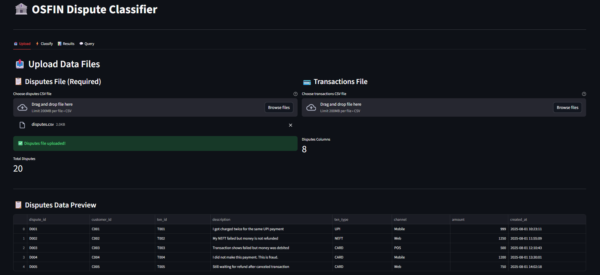
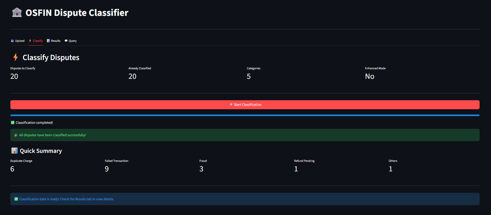
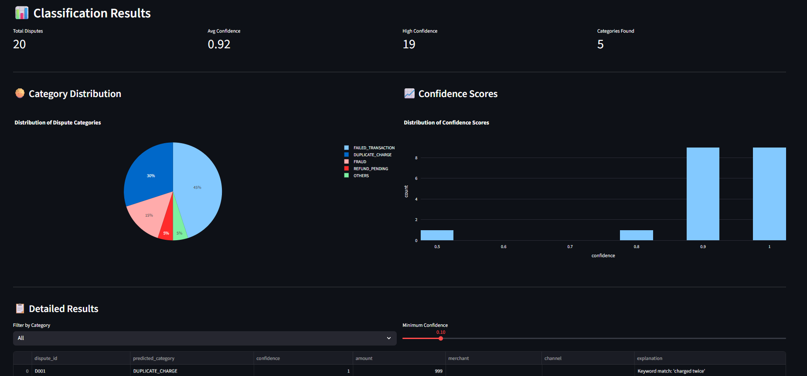
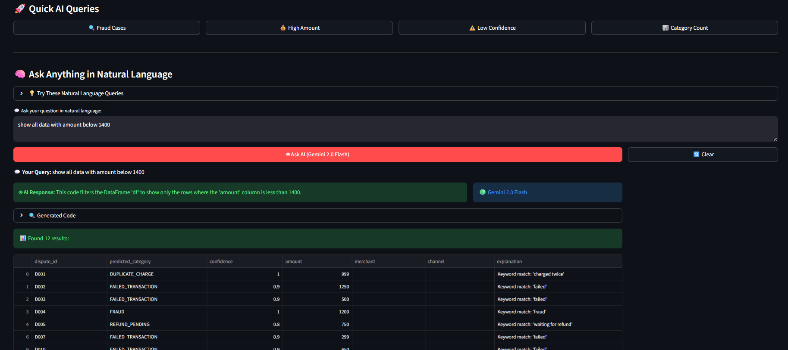

# 🏦 AI-Powered Dispute Assistant

An intelligent dispute classification and resolution system for fintechs and banks that provides reconciliation and settlement services. This AI assistant helps resolve payment disputes raised by customers including failed payments, chargebacks, duplicate transactions, and missing credits.

## 🎯 Project Overview

This project implements a comprehensive dispute management system that:

1. **Classifies disputes** into predefined categories using AI/ML models
2. **Suggests appropriate resolutions** based on dispute type and context
3. **Provides natural language query interface** for support agents using Gemini 2.0 Flash
4. **Offers interactive web interface** built with Streamlit

## 📸 Screenshots

### Upload Page



### Classify Page



### Result Page



### Query Page



## ✨ Features

### Core Features

- **Automated Dispute Classification** into 5 categories:

  - `DUPLICATE_CHARGE` - Multiple charges for same transaction
  - `FAILED_TRANSACTION` - Payment failed but amount debited
  - `FRAUD` - Unauthorized or suspicious transactions
  - `REFUND_PENDING` - Legitimate refund requests
  - `OTHERS` - Miscellaneous disputes

- **Smart Resolution Engine** that suggests actions:

  - Auto-refund
  - Manual review
  - Escalate to bank
  - Mark as potential fraud
  - Ask for more info

- **AI-Powered Query Interface** supporting natural language questions like:
  - "How many duplicate charges today?"
  - "Show all fraud disputes"
  - "List unresolved fraud disputes"
  - "Break down disputes by type"

### Enhanced Features

- **Transaction Context Integration** - Uses transaction data for improved classification accuracy
- **Fuzzy Matching Logic** - Detects duplicate transactions across datasets
- **Interactive Visualizations** - Dispute trends, category distributions, confidence scores
- **Real-time Processing** - Live classification with progress tracking
- **Export Capabilities** - Download results in CSV format

## 📁 Project Structure

```
OSFIN_ASSIGNMENT/
├── 📄 app.py                              # Main Streamlit application
├── 📄 requirements.txt                    # Python dependencies
├── 📄 env.local                          # Environment variables (API keys)
├── 📄 README.md                          # Project documentation
│
├── 📂 data/                              # Input data files
│   ├── disputes.csv                      # Customer disputes dataset
│   ├── transactions.csv                  # Transaction history dataset
│   └── Assignment_ AI-Powered Dispute Assistant.pdf
│
├── 📂 src/                               # Source code modules
│   ├── __init__.py
│   ├── classify.py                       # Dispute classification logic
│   ├── resolve.py                        # Resolution suggestion engine
│   ├── llm_query_processor.py           # Natural language query processing
│   └── pipeline.py                       # End-to-end processing pipeline
│
├── 📂 output/                            # Generated results
│   ├── classified_disputes.csv          # Task 1 output
│   └── resolutions.csv                   # Task 2 output
│
```

## 🚀 Installation & Setup

### Prerequisites

- Python 3.8+
- Google Gemini API key (for LLM features)

### 1. Clone the Repository

```bash
git clone https://github.com/ravin1100/OSFIN_Payement_Dispute_Assistant.git
cd OSFIN_ASSIGNMENT
```

### 2. Install Dependencies

```bash
pip install -r requirements.txt
```

### 3. Configure Environment Variables

Create or update the `env.local` file with your Google API key:

```env
GOOGLE_API_KEY=your_actual_gemini_api_key_here
```

**To get a Gemini API key:**

1. Visit [Google AI Studio](https://makersuite.google.com/app/apikey)
2. Sign in with your Google account
3. Create a new API key
4. Copy the key to your `env.local` file

### 4. Prepare Data Files

Ensure your data files are in the `data/` directory:

- `disputes.csv` - Required columns: `dispute_id`, `description`, `txn_id`, `amount`
- `transactions.csv` - Optional columns: `txn_id`, `amount`, `merchant`, `timestamp`, `status`

## 🏃‍♂️ How to Run

### Streamlit Web Interface

```bash
streamlit run app.py
```

Then open your browser to `http://localhost:8501`

## 📊 Usage Guide

### Step 1: Upload Data

1. Navigate to the **📤 Upload** tab
2. Upload your `disputes.csv` file
3. upload `transactions.csv` file

### Step 2: Classify Disputes

1. Go to the **⚡ Classify** tab
2. Click "🚀 Start Classification"
3. Wait for the AI to process all disputes

### Step 3: View Results

1. Check the **📊 Results** tab for:
   - Category distribution charts
   - Confidence score analysis
   - Detailed results table
   - Export options

### Step 4: Query with Natural Language

1. Visit the **💬 Query** tab
2. Enter questions in plain English:
   - "Show me all fraud cases"
   - "How many disputes have low confidence?"
   - "List high-amount duplicate charges"

## 🔧 API Integration

### Gemini 2.0 Flash Integration

The system uses Google's Gemini 2.0 Flash model for:

- Natural language query processing
- Code generation for data filtering
- Intelligent response generation

### Fallback Mode

If Gemini API is unavailable, the system falls back to:

- Rule-based query processing
- Pre-defined query templates
- Basic filtering capabilities

## 📈 Output Files

### Task 1: classified_disputes.csv

```csv
dispute_id,predicted_category,confidence,explanation,amount,merchant
D001,DUPLICATE_CHARGE,1.0,"Multiple charges detected for same transaction",999,Amazon
D002,FAILED_TRANSACTION,0.9,"Payment failed but amount debited",1250,PayPal
```

### Task 2: resolutions.csv

```csv
dispute_id,suggested_action,justification,priority,estimated_resolution_time
D001,Auto-refund,"Clear duplicate charge case",High,24 hours
D002,Manual review,"Requires transaction verification",Medium,2-3 days
```

## 🔍 Troubleshooting

### Common Issues

1. **Import Error**: `ModuleNotFoundError: No module named 'llm_query_processor'`

   - Solution: Ensure you're running from the project root directory

2. **API Key Error**: "Invalid API key"

   - Solution: Check your `env.local` file and verify the Gemini API key

3. **Data Format Error**: "Missing required columns"

   - Solution: Ensure CSV files have the correct column names

4. **Memory Issues**: Large datasets causing crashes
   - Solution: Process data in smaller batches or increase system memory
